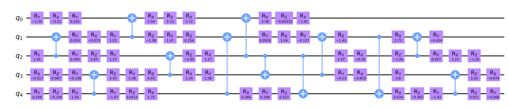

# State Preparing with Genetic Algorithm

## About this project

This project was built by members of Team #5 at the NTU-Qiskit Hackathon Taiwan 2023 and major maintenanced by Yu-Cheng Chung. This project focuses on performing Quantum State Preparation by utilizing a modification of a genetic algorithm structure.

## Algorithm


## Gene

Generate Gene using the matrix look like below,

$$
\begin{bmatrix}
G_{00} & G_{01} & \ldots & G_{0m} \\
G_{10} & G_{11} & \ldots & G_{1m} \\
\vdots & \vdots & \ddots & \vdots \\
G_{n0} & G_{n1} & \ldots & G_{nm} \\
\end{bmatrix}
$$

Here, $G_{ij}$ is the j-th gate of the i-th qubit. Each $G_{ij}$ is represented as a tuple `(gate, control)`, where:

- `gate` is the index of the gate in `gene_gates`.

- `control` is the index of the control qubit (if the gate has no control, the control value is ignored).

### Last Version

- Use basis gate in real computer to generate the circuit: CZ, ID, RZ, SX, X.

- Use empty gate to reduce depth of the circuit.

### This Version

- use high level to generate the circuit: RX, RY, RZ, CX.

- Add more rule when generate:

  - do not allow same rotate gate continuously.

  - do not allow more than three rotation gate in a rotation chain continnously.

## Results

### w-state (5 qubits)

- circuit


- probability distribution


- depth v.s. iter


### gaussian state (5 qubits)

- circuit



- probability distribution


- depth v.s. iter


## Environment setup

This project was built using Python 3.8.5. The required packages can be installed using the following command:

### No-GPU

```zsh
pip install -r requirement/requirement.txt
```

### NVIDIA-GPU

For cuda11.

```zsh
pip install -r requirement/requirement-cu11.txt
```

For cuda12.

```zsh
pip install -r requirement/requirement-cu12.txt
```
